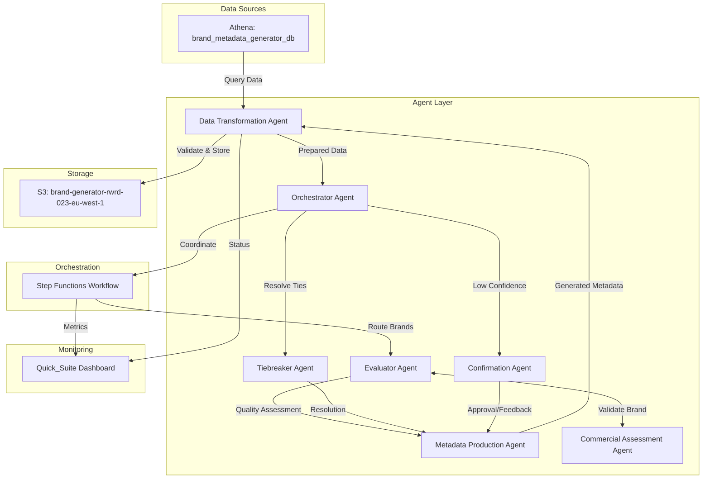
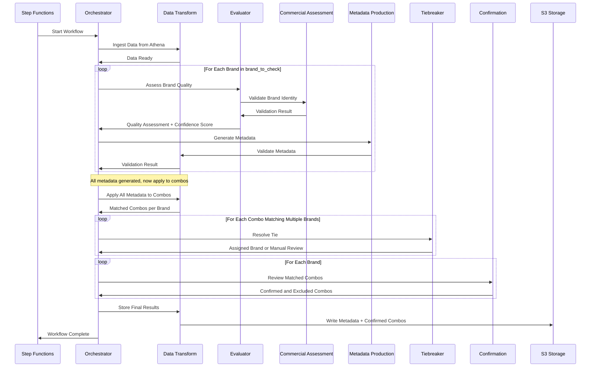
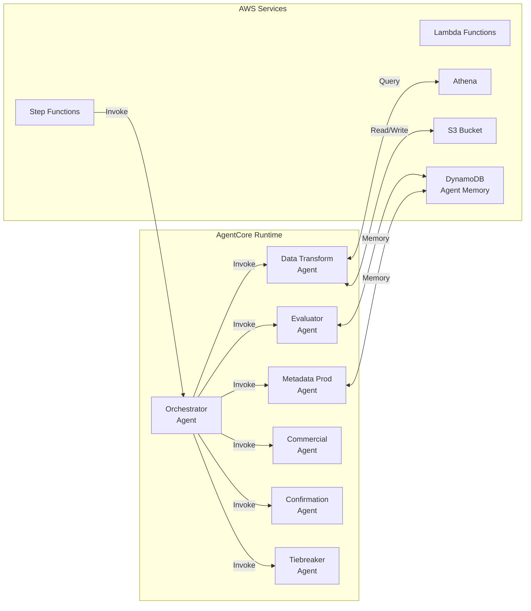

# Design Document: Brand Metadata Generator

## Overview

The Brand Metadata Generator is a sophisticated multi-agent system built on AWS Bedrock AgentCore that automatically generates classification metadata for over 3,000 retail brands. The system orchestrates seven specialized agents to analyze transaction data, generate regex patterns and MCCID lists, handle payment wallet complications, resolve brand classification ties, and ensure high-quality output through iterative refinement.

### System Goals

1. **Automated Metadata Generation**: Produce regex patterns and MCCID lists for all brands in brand_to_check table
2. **High Accuracy**: Achieve reliable brand classification through multi-agent validation and commercial assessment
3. **Payment Wallet Handling**: Detect and properly handle PayPal, Square, and other payment wallet complications
4. **Tie Resolution**: Resolve scenarios where narrative/MCCID combinations match multiple brands
5. **Quality Assurance**: Flag low-confidence brands for human review through agent confirmation workflow
6. **Scalability**: Process 3,000+ brands efficiently using parallel execution where appropriate
7. **Maintainability**: Use Infrastructure as Code (Terraform) for portable, version-controlled deployments

### Technology Stack

- **Agent Framework**: Strands API on AWS Bedrock AgentCore
- **Orchestration**: AWS Step Functions for workflow coordination
- **Data Storage**: AWS S3 (brand-generator-rwrd-023-eu-west-1)
- **Data Querying**: AWS Athena (database: brand_metadata_generator_db)
- **Compute**: AWS Lambda for serverless functions
- **Data Catalog**: AWS Glue
- **Monitoring**: AWS Quick_Suite for agent-specific dashboards
- **Infrastructure**: Terraform for IaC deployment
- **Version Control**: GitHub repository
- **Region**: eu-west-1 (all services)


## Architecture

### High-Level Architecture

The system follows a multi-agent orchestration pattern where a central Orchestrator coordinates specialized agents through AWS Step Functions. Data flows from Athena through transformation, evaluation, metadata production, and validation stages before being stored in S3.



### Workflow Sequence



### Agent Deployment Architecture

All agents are deployed to AWS Bedrock AgentCore using the Strands API framework. Each agent runs independently with its own execution role and can be invoked synchronously or asynchronously through Step Functions.



## Components and Interfaces

### 1. Orchestrator Agent

**Purpose**: Coordinates all other agents and manages the overall workflow for metadata generation.

**Responsibilities**:
- Initialize workflow by triggering data ingestion
- Distribute brands from brand_to_check to appropriate agents
- Route brands based on confidence scores (high confidence → storage, low confidence → confirmation)
- Handle tie detection and route to Tiebreaker Agent
- Coordinate iterative refinement loops (max 5 iterations per brand)
- Implement retry logic with exponential backoff for agent failures
- Track workflow state and progress

**Tools**:
- `invoke_data_transformation(action: str, params: dict) -> dict`: Trigger data ingestion or validation
- `invoke_evaluator(brandid: int, brand_data: dict) -> dict`: Request quality assessment
- `invoke_metadata_production(brandid: int, evaluation: dict, feedback: dict) -> dict`: Generate metadata
- `invoke_confirmation(brandid: int, metadata: dict, reason: str) -> dict`: Request human review
- `invoke_tiebreaker(tie_data: dict) -> dict`: Resolve brand ties
- `update_workflow_state(brandid: int, status: str, metadata: dict) -> dict`: Track progress

**Interface**:
```python
# Input from Step Functions
{
    "action": "start_workflow",
    "config": {
        "max_iterations": 5,
        "confidence_threshold": 0.75,
        "parallel_batch_size": 10
    }
}

# Output to Step Functions
{
    "status": "completed",
    "brands_processed": 3000,
    "brands_confirmed": 150,
    "ties_resolved": 45,
    "failures": []
}
```


### 2. Data Transformation Agent

**Purpose**: Handles all data ingestion, preparation, validation, and storage operations.

**Responsibilities**:
- Query Athena database brand_metadata_generator_db for all source tables
- Validate foreign key relationships between tables
- Prepare data structures for evaluator and metadata production agents
- Validate generated regex patterns (syntax correctness)
- Validate MCCID lists (existence in mcc table)
- Write validated metadata to S3 in structured format
- Handle data retrieval errors and notify orchestrator

**Tools**:
- `query_athena(table_name: str, filters: dict) -> dict`: Execute Athena queries
- `validate_regex(pattern: str) -> dict`: Check regex syntax
- `validate_mccids(mccid_list: list) -> dict`: Verify MCCIDs exist in mcc table
- `write_to_s3(brandid: int, metadata: dict) -> dict`: Store metadata in S3
- `read_from_s3(brandid: int) -> dict`: Retrieve existing metadata
- `prepare_brand_data(brandid: int) -> dict`: Aggregate all data for a brand

**Interface**:
```python
# Input: Data Ingestion
{
    "action": "ingest_data",
    "tables": ["brand", "brand_to_check", "combo", "mcc"]
}

# Output: Data Ready
{
    "status": "success",
    "brands_to_process": 3000,
    "total_combos": 150000,
    "data_quality": {
        "missing_foreign_keys": 0,
        "invalid_records": 5
    }
}

# Input: Validate and Store
{
    "action": "validate_and_store",
    "brandid": 123,
    "metadata": {
        "regex": "^STARBUCKS.*",
        "mccids": [5812, 5814],
        "requires_confirmation": false
    }
}

# Output: Storage Result
{
    "status": "success",
    "brandid": 123,
    "s3_key": "metadata/brand_123.json",
    "validation_errors": []
}
```


### 3. Evaluator Agent

**Purpose**: Assesses data quality, identifies issues, and calculates confidence scores for each brand.

**Responsibilities**:
- Analyze narrative patterns for consistency across combo records
- Identify payment wallet indicators (PAYPAL, PP, SQ, SQUARE)
- Flag wallet-affected combo records
- Assess MCCID consistency with brand sector
- Detect potential misclassifications
- Calculate confidence scores based on data quality
- Generate prompts for Metadata Production Agent describing issues
- Coordinate with Commercial Assessment Agent for brand validation
- Identify ties (narrative/MCCID combinations matching multiple brands)

**Tools**:
- `analyze_narratives(brandid: int, combos: list) -> dict`: Assess narrative consistency
- `detect_payment_wallets(narratives: list) -> dict`: Identify wallet complications
- `assess_mccid_consistency(brandid: int, mccids: list, sector: str) -> dict`: Check MCCID alignment
- `calculate_confidence_score(analysis_results: dict) -> float`: Compute confidence
- `generate_production_prompt(brandid: int, issues: list) -> str`: Create guidance for metadata production
- `detect_ties(brandid: int, combos: list) -> dict`: Identify multi-brand matches

**Interface**:
```python
# Input
{
    "action": "evaluate_brand",
    "brandid": 123,
    "brand_data": {
        "brandname": "Starbucks",
        "sector": "Food & Beverage",
        "combos": [
            {"ccid": 1001, "bankid": 1, "narrative": "STARBUCKS #1234", "mccid": 5812},
            {"ccid": 1002, "bankid": 1, "narrative": "SQ *STARBUCKS", "mccid": 7399}
        ]
    }
}

# Output
{
    "brandid": 123,
    "confidence_score": 0.65,
    "issues": [
        {
            "type": "payment_wallet",
            "description": "Square wallet detected in 30% of narratives",
            "affected_combos": [(1002, 1)]
        },
        {
            "type": "mccid_mismatch",
            "description": "MCCID 7399 inconsistent with Food & Beverage sector",
            "affected_combos": [(1002, 1)]
        }
    ],
    "wallet_affected": true,
    "ties_detected": [],
    "production_prompt": "Generate regex excluding 'SQ *' prefix. Focus on MCCID 5812 as primary."
}
```


### 4. Metadata Production Agent

**Purpose**: Generates regex patterns and MCCID lists based on evaluator findings and feedback.

**Responsibilities**:
- Generate regex patterns for narrative matching
- Generate lists of legitimate MCCIDs for each brand
- Exclude payment wallet text from regex patterns when appropriate
- Incorporate feedback from Confirmation Agent for regeneration
- Apply disambiguation guidance from Tiebreaker Agent
- Maintain context from previous iterations
- Limit to 5 iteration attempts per brand

**Tools**:
- `generate_regex(brandid: int, narratives: list, guidance: str) -> str`: Create regex pattern
- `generate_mccid_list(brandid: int, mccids: list, guidance: str) -> list`: Create MCCID list
- `filter_wallet_text(narratives: list, wallet_indicators: list) -> list`: Remove wallet noise
- `apply_disambiguation(regex: str, tie_guidance: dict) -> str`: Refine regex for tie resolution
- `validate_pattern_coverage(regex: str, narratives: list) -> dict`: Test regex against samples

**Interface**:
```python
# Input: Initial Generation
{
    "action": "generate_metadata",
    "brandid": 123,
    "evaluation": {
        "confidence_score": 0.65,
        "issues": [...],
        "production_prompt": "Generate regex excluding 'SQ *' prefix..."
    },
    "brand_data": {
        "brandname": "Starbucks",
        "combos": [...]
    },
    "iteration": 1
}

# Output
{
    "brandid": 123,
    "regex": "^(?:STARBUCKS|SBUX)\\s*#?\\d*",
    "mccids": [5812, 5814],
    "coverage": {
        "narratives_matched": 0.95,
        "false_positives": 0.02
    },
    "iteration": 1
}

# Input: Regeneration with Feedback
{
    "action": "regenerate_metadata",
    "brandid": 123,
    "previous_metadata": {...},
    "feedback": "Regex too broad, matches Starbucks and Starwood. Add word boundary.",
    "iteration": 2
}
```


### 5. Commercial Assessment Agent

**Purpose**: Validates brand names and sectors against real-world commercial identity.

**Responsibilities**:
- Verify brandname corresponds to real commercial entity
- Validate sector classification appropriateness
- Suggest alternative sectors when misclassification detected
- Provide validation results to Evaluator Agent
- Flag brands that don't match known entities

**Tools**:
- `verify_brand_exists(brandname: str) -> dict`: Check if brand is real
- `validate_sector(brandname: str, sector: str) -> dict`: Verify sector appropriateness
- `suggest_alternative_sectors(brandname: str, current_sector: str) -> list`: Recommend corrections
- `get_brand_info(brandname: str) -> dict`: Retrieve commercial information

**Interface**:
```python
# Input
{
    "action": "validate_brand",
    "brandname": "Starbucks",
    "sector": "Food & Beverage"
}

# Output: Valid Brand
{
    "brandname": "Starbucks",
    "exists": true,
    "sector_valid": true,
    "confidence": 0.98,
    "commercial_info": {
        "official_name": "Starbucks Corporation",
        "primary_sector": "Food & Beverage",
        "alternative_sectors": ["Retail"]
    }
}

# Output: Invalid Brand
{
    "brandname": "XYZ Unknown Store",
    "exists": false,
    "sector_valid": false,
    "confidence": 0.1,
    "recommendation": "Flag for manual review"
}
```


### 6. Confirmation Agent

**Purpose**: Reviews combos matched to brands AFTER metadata application to exclude ambiguous matches.

**Responsibilities**:
- Review combos that matched a brand's regex and MCCID metadata
- Identify false positives where common words in brand names match unrelated combos
- Exclude combos that have low confidence of belonging to the brand
- Handle ambiguous brand names (e.g., "Apple" matching both Apple Inc. and apple orchards)
- Provide final confirmation on which combos truly belong to each brand
- Flag combos requiring human review

**Tools**:
- `review_matched_combos(brandid: int, matched_combos: list, metadata: dict) -> dict`: Evaluate combo matches
- `confirm_combo(ccid: int, bankid: int, brandid: int) -> dict`: Confirm combo belongs to brand
- `exclude_combo(ccid: int, bankid: int, brandid: int, reason: str) -> dict`: Exclude combo from brand
- `flag_for_human_review(ccid: int, bankid: int, brandid: int, reason: str) -> dict`: Escalate ambiguous combo

**Interface**:
```python
# Input
{
    "action": "review_matches",
    "brandid": 123,
    "brandname": "Apple",
    "metadata": {
        "regex": "^APPLE.*",
        "mccids": [5732, 5734]
    },
    "matched_combos": [
        {"ccid": 1001, "bankid": 1, "narrative": "APPLE STORE #123", "mccid": 5732},
        {"ccid": 1002, "bankid": 1, "narrative": "APPLE ORCHARD FARM", "mccid": 5499},
        {"ccid": 1003, "bankid": 2, "narrative": "APPLE INC ONLINE", "mccid": 5734}
    ]
}

# Output
{
    "brandid": 123,
    "confirmed_combos": [(1001, 1), (1003, 2)],
    "excluded_combos": [
        {
            "ccid": 1002,
            "bankid": 1,
            "reason": "MCCID 5499 (Misc Food Stores) inconsistent with Apple Inc. Likely apple orchard."
        }
    ],
    "requires_human_review": []
}
```


### 7. Tiebreaker Agent

**Purpose**: Resolves scenarios where a combo matches multiple brands AFTER metadata application.

**Responsibilities**:
- Analyze combos that matched multiple brands' regex and MCCID metadata
- Determine which brand the combo most likely belongs to
- Consider narrative text patterns, MCCID, and brand characteristics
- Assign combo to the most appropriate brand
- Flag combos that cannot be resolved with high confidence for human review

**Tools**:
- `resolve_multi_match(ccid: int, bankid: int, matching_brands: list, combo_data: dict) -> dict`: Determine correct brand
- `analyze_narrative_similarity(narrative: str, brand_names: list) -> dict`: Compare narrative to brand names
- `compare_mccid_alignment(mccid: int, brands: list) -> dict`: Check MCCID fit for each brand
- `calculate_match_confidence(ccid: int, bankid: int, brandid: int) -> float`: Compute confidence score

**Interface**:
```python
# Input
{
    "action": "resolve_tie",
    "ccid": 5001,
    "bankid": 1,
    "combo": {
        "narrative": "SHELL STATION 123",
        "mccid": 5541,
        "mid": "MID123"
    },
    "matching_brands": [
        {
            "brandid": 100,
            "brandname": "Shell",
            "sector": "Fuel",
            "metadata": {
                "regex": "^SHELL.*",
                "mccids": [5541, 5542]
            }
        },
        {
            "brandid": 200,
            "brandname": "Shell Station Convenience",
            "sector": "Retail",
            "metadata": {
                "regex": "^SHELL STATION.*",
                "mccids": [5411, 5541]
            }
        }
    ]
}

# Output: Resolved to Single Brand
{
    "ccid": 5001,
    "bankid": 1,
    "resolution_type": "single_brand",
    "assigned_brandid": 200,
    "confidence": 0.92,
    "reasoning": "Narrative contains 'STATION' which is specific to brand 200. Brand 200 regex is more specific."
}

# Output: Cannot Resolve
{
    "ccid": 5001,
    "bankid": 1,
    "resolution_type": "manual_review",
    "confidence": 0.45,
    "reasoning": "Both brands equally likely. Requires human judgment.",
    "requires_human_review": true
}
```


### 8. Feedback Processing Agent

**Purpose**: Parses and processes human feedback to generate actionable improvements for metadata refinement.

**Responsibilities**:
- Parse natural language feedback from humans
- Extract specific combo IDs mentioned in feedback
- Identify feedback categories (regex too broad, missing patterns, wrong MCCIDs, false positives)
- Generate structured prompts for Metadata Production Agent based on feedback
- Track feedback patterns across brands
- Store feedback with full context and version history

**Tools**:
- `parse_feedback(feedback_text: str, brandid: int) -> dict`: Extract structured data from natural language
- `identify_misclassified_combos(feedback: dict) -> list`: Find specific combo examples mentioned
- `analyze_feedback_category(feedback: dict) -> str`: Categorize feedback type
- `generate_refinement_prompt(feedback: dict, current_metadata: dict, brand_data: dict) -> str`: Create specific guidance
- `store_feedback(brandid: int, feedback: dict, metadata_version: int) -> dict`: Persist to S3 and DynamoDB
- `retrieve_feedback_history(brandid: int) -> list`: Get all previous feedback for a brand

**Interface**:
```python
# Input: General Feedback
{
    "action": "process_feedback",
    "brandid": 123,
    "metadata_version": 2,
    "feedback_type": "general",
    "feedback_text": "Too many false positives for Starbucks. Regex is matching Starburst candy and Starbucks Hotel.",
    "current_metadata": {
        "regex": "^STARBUCKS.*",
        "mccids": [5812, 5814]
    }
}

# Input: Specific Examples
{
    "action": "process_feedback",
    "brandid": 123,
    "metadata_version": 2,
    "feedback_type": "specific_examples",
    "feedback_text": "Combo 12345 should not be Starbucks - it's Starburst candy. Combo 67890 is Starbucks Hotel, not the coffee chain.",
    "misclassified_combos": [12345, 67890]
}

# Output
{
    "brandid": 123,
    "feedback_processed": true,
    "feedback_category": "regex_too_broad",
    "issues_identified": [
        "Regex matches unrelated brands (Starburst, Starbucks Hotel)",
        "Need negative lookahead to exclude non-coffee businesses"
    ],
    "misclassified_combos": [12345, 67890],
    "refinement_prompt": "Generate regex that matches Starbucks coffee shops but excludes: 1) Starburst candy (different brand), 2) Starbucks Hotel (hospitality, not coffee). Use negative lookahead patterns. Analyze combos 12345 and 67890 to understand false positive patterns.",
    "recommended_action": "regenerate_metadata",
    "feedback_stored": true,
    "storage_location": "s3://brand-generator-rwrd-023-eu-west-1/feedback/brand_123_v2.json"
}
```


### 9. Learning Analytics Agent

**Purpose**: Analyzes historical feedback to identify systematic improvements and track accuracy trends over time.

**Responsibilities**:
- Aggregate feedback across all brands
- Identify common issues (e.g., wallet handling problems, sector mismatches)
- Calculate accuracy metrics per brand (false positive rate, approval rate, iteration count)
- Track accuracy improvements over time
- Generate improvement recommendations for system-wide issues
- Produce reports for management showing trends and insights
- Identify problematic brands requiring additional attention

**Tools**:
- `analyze_feedback_trends(time_range: str, filters: dict) -> dict`: Identify patterns across brands
- `calculate_accuracy_metrics(brandid: int) -> dict`: Measure classification accuracy
- `calculate_improvement_rate(brandid: int, time_range: str) -> float`: Track accuracy changes
- `identify_common_issues(min_frequency: int) -> list`: Find systematic problems
- `generate_improvement_report(time_range: str) -> dict`: Create management summary
- `identify_problematic_brands(threshold: float) -> list`: Find brands needing attention
- `analyze_wallet_handling_effectiveness() -> dict`: Assess payment wallet detection accuracy
- `recommend_system_improvements() -> list`: Generate actionable recommendations

**Interface**:
```python
# Input: Analyze Trends
{
    "action": "analyze_trends",
    "time_range": "last_30_days",
    "filters": {
        "min_feedback_count": 2
    }
}

# Output
{
    "analysis_period": "2026-01-15 to 2026-02-15",
    "total_brands_processed": 3000,
    "brands_with_feedback": 450,
    "common_issues": [
        {
            "issue": "regex_too_broad",
            "frequency": 120,
            "percentage": 26.7,
            "example_brands": [123, 456, 789]
        },
        {
            "issue": "wallet_text_not_excluded",
            "frequency": 85,
            "percentage": 18.9,
            "example_brands": [234, 567]
        },
        {
            "issue": "mccid_mismatch",
            "frequency": 60,
            "percentage": 13.3,
            "example_brands": [345, 678]
        }
    ],
    "accuracy_trends": {
        "average_approval_rate": 0.85,
        "average_iterations_per_brand": 1.8,
        "improvement_rate": 0.12  # 12% improvement over period
    },
    "problematic_brands": [
        {
            "brandid": 999,
            "brandname": "Apple",
            "feedback_count": 8,
            "approval_rate": 0.3,
            "issue": "Ambiguous name matches apple orchards"
        }
    ],
    "recommendations": [
        "Improve wallet detection to handle 'SQ *' prefix patterns",
        "Add negative lookahead training for common false positives",
        "Review brands with common words (Apple, Shell, etc.) for disambiguation"
    ]
}

# Input: Generate Report
{
    "action": "generate_report",
    "time_range": "last_month",
    "report_type": "executive_summary"
}

# Output
{
    "report_title": "Brand Metadata Generator - Monthly Performance Report",
    "period": "January 2026",
    "summary": {
        "brands_processed": 3000,
        "brands_approved_first_attempt": 2550,
        "brands_requiring_feedback": 450,
        "average_iterations": 1.8,
        "overall_approval_rate": 0.92
    },
    "accuracy_improvement": "+12% vs previous month",
    "top_issues": ["regex_too_broad", "wallet_handling", "mccid_mismatch"],
    "success_stories": [
        "Wallet detection improved from 75% to 89% accuracy",
        "Average iterations reduced from 2.3 to 1.8"
    ],
    "action_items": [
        "Focus on ambiguous brand names (Apple, Shell, etc.)",
        "Enhance wallet pattern detection",
        "Review MCCID-sector mappings for retail brands"
    ]
}
```


## Data Models

### Input Data Models (Athena Tables)

**Brand Table**:
```python
{
    "brandid": int,        # Primary key
    "brandname": str,      # Brand name (e.g., "Starbucks")
    "sector": str          # Business sector (e.g., "Food & Beverage")
}
```

**Brand_to_Check Table**:
```python
{
    "brandid": int         # Primary key, subset of brands requiring metadata
}
```

**Combo Table**:
```python
{
    "ccid": int,           # Primary key (composite with bankid)
    "bankid": int,         # Primary key (composite with ccid) - tinyint, identifies the bank
    "mid": str,            # Merchant ID
    "brandid": int,        # Foreign key to brand table
    "mccid": int,          # Foreign key to mcc table
    "narrative": str       # Transaction description text
}
```

**Note**: The combo table uses a composite primary key of (ccid, bankid), meaning the same ccid can exist across different banks.

**MCC Table**:
```python
{
    "mccid": int,          # Primary key
    "mcc_desc": str,       # MCC description
    "sector": str          # Business sector
}
```

### Output Data Model (S3 Storage)

**Brand Metadata and Matched Combos**:
```python
{
    "brandid": int,
    "brandname": str,
    "sector": str,
    "metadata": {
        "regex_pattern": str,              # Regex for narrative matching
        "mccids": list[int],               # List of legitimate MCCIDs
        "confidence_score": float,         # 0.0 to 1.0
        "generation_metadata": {
            "iterations": int,
            "wallet_affected": bool,
            "issues_identified": list[str],
            "timestamp": str,              # ISO 8601 format
            "version": str                 # Metadata version
        }
    },
    "matched_combos": {
        "confirmed": list[tuple[int, int]],  # (ccid, bankid) tuples confirmed to belong to this brand
        "excluded": list[{
            "ccid": int,
            "bankid": int,
            "reason": str                  # Why combo was excluded
        }],
        "ties_resolved": list[{
            "ccid": int,
            "bankid": int,
            "other_brands": list[int],     # Other brands that also matched
            "resolution": str              # How tie was resolved
        }],
        "requires_human_review": list[tuple[int, int]]  # (ccid, bankid) tuples needing manual review
    },
    "statistics": {
        "total_matched": int,              # Total combos that matched metadata
        "total_confirmed": int,            # Combos confirmed by Confirmation Agent
        "total_excluded": int,             # Combos excluded as false positives
        "total_ties": int,                 # Combos that matched multiple brands
        "exclusion_rate": float            # Percentage of matches excluded
    }
}
```

**Example**:
```json
{
    "brandid": 123,
    "brandname": "Starbucks",
    "sector": "Food & Beverage",
    "metadata": {
        "regex_pattern": "^(?:STARBUCKS|SBUX)\\s*(?:#\\d+)?",
        "mccids": [5812, 5814],
        "confidence_score": 0.92,
        "generation_metadata": {
            "iterations": 2,
            "wallet_affected": true,
            "issues_identified": ["payment_wallet_square"],
            "timestamp": "2024-02-15T10:30:00Z",
            "version": "1.0"
        }
    },
    "matched_combos": {
        "confirmed": [[1001, 1], [1002, 1], [1005, 2], [1008, 1], [1012, 2]],
        "excluded": [
            {
                "ccid": 1003,
                "bankid": 1,
                "reason": "Narrative 'STARBURST CANDY' matched regex but is unrelated product"
            }
        ],
        "ties_resolved": [
            {
                "ccid": 1010,
                "bankid": 1,
                "other_brands": [456],
                "resolution": "Assigned to Starbucks based on MCCID 5812 alignment"
            }
        ],
        "requires_human_review": []
    },
    "statistics": {
        "total_matched": 7,
        "total_confirmed": 5,
        "total_excluded": 1,
        "total_ties": 1,
        "exclusion_rate": 0.14
    }
}
```


### Internal Data Models

**Evaluation Result**:
```python
{
    "brandid": int,
    "confidence_score": float,
    "issues": list[{
        "type": str,                    # "payment_wallet", "mccid_mismatch", "narrative_inconsistency"
        "description": str,
        "affected_combos": list[int],   # ccid values
        "severity": str                 # "low", "medium", "high"
    }],
    "wallet_affected": bool,
    "wallet_indicators": list[str],     # ["PAYPAL", "SQ", etc.]
    "ties_detected": list[{
        "narrative": str,
        "mccid": int,
        "matching_brands": list[int]
    }],
    "production_prompt": str,
    "commercial_validation": {
        "brand_exists": bool,
        "sector_valid": bool,
        "confidence": float
    }
}
```

**Workflow State**:
```python
{
    "brandid": int,
    "status": str,                      # "pending", "evaluating", "generating", "confirming", "completed", "failed"
    "current_iteration": int,
    "max_iterations": int,
    "metadata": dict,                   # Current metadata
    "history": list[{
        "iteration": int,
        "action": str,
        "timestamp": str,
        "result": dict
    }]
}
```

**Tie Resolution**:
```python
{
    "tie_id": str,                      # Unique identifier
    "narrative": str,
    "mccid": int,
    "matching_brands": list[{
        "brandid": int,
        "brandname": str,
        "combo_count": int
    }],
    "resolution": {
        "type": str,                    # "single_brand", "split_pattern", "manual_review"
        "primary_brandid": int,         # If single_brand
        "disambiguation_rules": dict,   # If split_pattern
        "confidence": float
    }
}
```

**Human Feedback**:
```python
{
    "feedback_id": str,                 # Unique identifier (UUID)
    "brandid": int,
    "metadata_version": int,            # Version of metadata being reviewed
    "timestamp": str,                   # ISO 8601 format
    "feedback_type": str,               # "general", "specific_examples", "approval", "rejection"
    "feedback_text": str,               # Natural language feedback
    "misclassified_combos": list[int],  # Specific ccids mentioned (if any)
    "action_taken": str,                # "approved", "rejected", "regenerate_requested"
    "reviewer_id": str,                 # ID of human reviewer
    "issues_identified": list[str],     # Parsed issues from feedback
    "refinement_prompt": str            # Generated prompt for metadata production (if applicable)
}
```

**Feedback History Entry**:
```python
{
    "brandid": int,
    "feedback_history": list[{
        "version": int,
        "timestamp": str,
        "metadata": {
            "regex": str,
            "mccids": list[int],
            "confidence_score": float
        },
        "feedback": {
            "feedback_id": str,
            "feedback_type": str,
            "feedback_text": str,
            "action_taken": str
        },
        "classification_results": {
            "total_matched": int,
            "confirmed": int,
            "excluded": int,
            "ties_resolved": int
        }
    }],
    "current_version": int,
    "total_iterations": int,
    "approval_status": str              # "pending", "approved", "needs_work", "escalated"
}
```

**Learning Analytics Metrics**:
```python
{
    "brandid": int,
    "accuracy_metrics": {
        "approval_rate": float,         # Percentage of first-attempt approvals
        "false_positive_rate": float,   # Percentage of matched combos excluded
        "iteration_count": int,         # Number of regeneration cycles
        "feedback_count": int,          # Total feedback submissions
        "last_updated": str             # ISO 8601 timestamp
    },
    "issue_categories": dict[str, int], # Count of each issue type
    "improvement_trend": {
        "initial_approval_rate": float,
        "current_approval_rate": float,
        "improvement_percentage": float
    }
}
```


## Detailed Workflow Design

### Phase 1: Initialization and Data Ingestion

**Step 1.1: Start Workflow**
- Step Functions initiates Orchestrator Agent
- Orchestrator loads configuration (confidence threshold, max iterations, batch size)

**Step 1.2: Data Ingestion**
- Orchestrator invokes Data Transformation Agent with "ingest_data" action
- Data Transformation Agent queries Athena database brand_metadata_generator_db:
  - Query brand table for all brands
  - Query brand_to_check table for target brands
  - Query combo table for all transaction records
  - Query mcc table for MCC definitions
- Validate foreign key relationships
- Return data quality report to Orchestrator

**Step 1.3: Prepare Brand Queue**
- Orchestrator creates processing queue from brand_to_check
- Optionally batch brands for parallel processing (configurable batch size)

### Phase 2: Brand Evaluation and Metadata Generation

**For Each Brand in Queue:**

**Step 2.1: Prepare Brand Data**
- Data Transformation Agent aggregates all combo records for brandid
- Retrieve brand name and sector from brand table
- Package data for evaluation

**Step 2.2: Evaluate Brand Quality**
- Orchestrator invokes Evaluator Agent with brand data
- Evaluator performs:
  - Narrative pattern analysis
  - Payment wallet detection
  - MCCID consistency check
  - Tie detection
- Evaluator invokes Commercial Assessment Agent for brand validation
- Evaluator calculates confidence score
- Evaluator generates production prompt with guidance
- Return evaluation result to Orchestrator

**Step 2.3: Route Based on Confidence**

**If confidence_score >= threshold (e.g., 0.75):**
- Proceed to Step 2.4 (Generate Metadata)

**If confidence_score < threshold:**
- Mark brand as "Requiring Agent Confirmation"
- Route to Phase 4 (Confirmation Workflow)

**Step 2.4: Generate Metadata**
- Orchestrator invokes Metadata Production Agent with:
  - Brand data
  - Evaluation result
  - Production prompt
  - Current iteration number
- Metadata Production Agent generates:
  - Regex pattern (excluding wallet text if needed)
  - MCCID list
  - Coverage statistics
- Return metadata to Orchestrator

**Step 2.5: Validate Metadata**
- Orchestrator invokes Data Transformation Agent with "validate_and_store" action
- Data Transformation Agent validates:
  - Regex syntax correctness
  - MCCID existence in mcc table
  - No validation errors → Proceed to Step 2.6
  - Validation errors → Send feedback to Metadata Production Agent, increment iteration, retry (max 5 iterations)

**Step 2.6: Store Metadata**
- Data Transformation Agent writes metadata to S3
- S3 key format: `metadata/brand_{brandid}.json`
- Update workflow state to "completed"


### Phase 3: Metadata Application and Combo Matching

**Step 3.1: Apply Metadata to All Combos**
- For each brand with generated metadata, apply regex and MCCID filters to all combo records
- Match combos where:
  - Narrative matches the brand's regex pattern AND
  - MCCID is in the brand's MCCID list
- Store matched combos for each brand

**Step 3.2: Identify Multi-Brand Matches (Ties)**
- Identify combos that matched multiple brands
- Package tie data with combo details and all matching brands

**Step 3.3: Route to Tiebreaker**
- For each combo matching multiple brands, invoke Tiebreaker Agent
- Tiebreaker analyzes narrative, MCCID, and brand characteristics
- Tiebreaker assigns combo to most likely brand or flags for human review

**Step 3.4: Confirmation Review**
- For each brand, invoke Confirmation Agent with all matched combos
- Confirmation Agent reviews matches to exclude false positives
- Particular focus on brands with ambiguous names (common words)
- Confirmation Agent confirms or excludes each combo

**Step 3.5: Generate Final Output**
- For each brand, compile:
  - Metadata (regex pattern, MCCID list)
  - Confirmed combo list (ccids that belong to this brand)
  - Excluded combo list (ccids that were matched but excluded)
  - Tie resolutions (ccids that matched multiple brands and how they were resolved)

### Phase 4: Storage and Reporting

**Step 4.1: Store Complete Results**
- Write to S3 for each brand:
  - Metadata
  - Confirmed combo list
  - Statistics (total matched, confirmed, excluded, ties resolved)

**Step 4.2: Generate Summary Report**
- Aggregate statistics across all brands:
  - Total brands processed
  - Total combos matched
  - Total combos confirmed
  - Total combos excluded
  - Total ties resolved
  - Combos requiring human review

**Step 4.3: Update Quick_Suite Dashboard**
- Display brand-level results
- Highlight brands with high exclusion rates
- Show combos requiring human review
- Provide drill-down into specific combo matches


### Phase 5: Human Review and Feedback (NEW)

**Step 5.1: Store Preliminary Results**
- Data Transformation Agent writes preliminary classification results to S3
- Results include: metadata used, matched combos, confirmed combos, excluded combos, ties resolved
- Mark brand status as "pending_human_review"

**Step 5.2: Display in Quick_Suite Dashboard**
- Quick_Suite loads preliminary results for human review
- Display grouped by brand with:
  - Brand name and sector
  - Regex pattern and MCCID list used
  - Total combos matched, confirmed, excluded
  - Sample narratives (matched and excluded)
  - Confidence score
- Provide feedback input interface

**Step 5.3: Human Reviews Classifications**
- Human examines classification results per brand
- Reviews sample narratives to assess accuracy
- Identifies issues (false positives, missed patterns, etc.)
- Provides feedback through interface:
  - General text feedback describing issues
  - Specific combo IDs that are misclassified
  - Approve or reject classifications

**Step 5.4: Submit Feedback**
- System stores feedback in S3 and DynamoDB
- Feedback includes: brandid, metadata_version, feedback_type, text, timestamp
- If approved: Mark brand as complete, proceed to Phase 7
- If rejected or issues identified: Proceed to Phase 6

### Phase 6: Feedback Processing and Learning (NEW)

**Step 6.1: Parse Feedback**
- Orchestrator invokes Feedback Processing Agent
- Agent parses natural language feedback
- Extracts structured information:
  - Issue categories (regex too broad, missing patterns, MCCID issues)
  - Specific combo examples mentioned
  - Patterns in misclassifications

**Step 6.2: Analyze Misclassified Combos**
- If specific combos mentioned, retrieve their details from Athena
- Analyze narratives to identify common patterns
- Compare to current regex to understand why they matched/didn't match
- Identify what needs to change

**Step 6.3: Generate Refinement Prompt**
- Feedback Processing Agent creates specific guidance for Metadata Production Agent
- Prompt includes:
  - Issues identified from feedback
  - Specific examples to consider
  - Patterns to include or exclude
  - MCCID adjustments needed

**Step 6.4: Regenerate Metadata**
- Orchestrator invokes Metadata Production Agent with refinement prompt
- Agent generates new regex pattern and MCCID list
- Incorporates feedback and learns from examples
- Increment metadata version number

**Step 6.5: Re-apply and Re-classify**
- Data Transformation Agent applies new metadata to combos
- Confirmation Agent reviews new matches
- Tiebreaker Agent resolves any new ties
- Generate new preliminary results

**Step 6.6: Check Iteration Limit**
- If iterations < 10: Return to Phase 5 (human review)
- If iterations >= 10: Escalate to management, mark for manual intervention

**Step 6.7: Update Learning Analytics**
- Learning Analytics Agent records feedback and iteration
- Updates accuracy metrics for the brand
- Contributes to system-wide trend analysis

### Phase 7: Final Storage and Analytics (UPDATED)

**Step 7.1: Store Final Approved Results**
- Data Transformation Agent writes final results to S3
- Include complete metadata history with all versions
- Include all feedback received
- Mark brand as "completed"

**Step 7.2: Update Learning Analytics**
- Learning Analytics Agent updates metrics:
  - Approval rate for this brand
  - Total iterations required
  - Issue categories encountered
  - Improvement over iterations
- Aggregate into system-wide statistics

**Step 7.3: Generate Reports**
- Create summary report with:
  - Processing statistics
  - Quality metrics (average confidence score, approval rates)
  - Issue breakdown (wallet complications, ties, ambiguous matches)
  - Brands requiring human review
  - Accuracy trends over time
- Store report in S3 for management review

**Step 7.4: Update Quick_Suite Dashboard**
- Push final metrics to Quick_Suite for visualization
- Update brand status indicators
- Display accuracy trends and improvements
- Highlight any brands requiring attention

**Step 7.5: Return to Step Functions**
- Orchestrator returns completion status to Step Functions
- Include summary statistics and any escalations
- Step Functions marks workflow as complete

### Phase 8: Workflow Completion

### Phase 8: Workflow Completion

**Step 8.1: Aggregate Results**
- Orchestrator collects statistics:
  - Total brands processed
  - Total combos matched across all brands
  - Total combos confirmed
  - Total combos excluded
  - Ties resolved
  - Combos requiring human review

**Step 8.2: Generate Report**
- Create summary report with:
  - Processing statistics
  - Quality metrics (average confidence score, exclusion rates)
  - Issue breakdown (wallet complications, ties, ambiguous matches)
  - Combos requiring human review

**Step 8.3: Update Quick_Suite Dashboard**
- Push metrics to Quick_Suite for visualization
- Update brand status indicators
- Highlight brands and combos requiring attention

**Step 8.4: Return to Step Functions**
- Orchestrator returns completion status to Step Functions
- Step Functions marks workflow as complete

## Payment Wallet Handling Strategy

### Detection

The Evaluator Agent detects payment wallets by scanning narratives for indicators:
- "PAYPAL" (case-insensitive)
- "PP *" (PayPal prefix pattern)
- "SQ *" (Square prefix pattern)
- "SQUARE" (case-insensitive)

### Impact Analysis

When wallets are detected:
1. **Narrative Contamination**: Wallet text obscures actual brand name
   - Example: "SQ *STARBUCKS" → "STARBUCKS" is the actual brand
2. **MCCID Misclassification**: Wallets often use generic MCCs
   - Example: Square uses 7399 (Business Services) regardless of actual merchant type
3. **Pattern Inconsistency**: Some transactions show wallet, others don't
   - Example: 70% "STARBUCKS", 30% "SQ *STARBUCKS"

### Handling Strategy

**Step 1: Identify Wallet-Affected Combos**
- Evaluator flags all combo records containing wallet indicators
- Calculate percentage of wallet-affected vs clean narratives

**Step 2: Generate Guidance**
- If wallet-affected < 20%: Ignore wallet narratives, focus on clean ones
- If wallet-affected 20-50%: Generate regex that matches both patterns
- If wallet-affected > 50%: Generate regex excluding wallet prefix, flag for confirmation

**Step 3: MCCID Filtering**
- Identify MCCIDs that only appear in wallet-affected combos
- Exclude these MCCIDs from the legitimate list
- Example: If 7399 only appears with "SQ *", exclude it

**Step 4: Regex Generation**
- Metadata Production Agent creates patterns that:
  - Match brand name with or without wallet prefix
  - Use optional non-capturing groups for wallet text
  - Example: `^(?:SQ \*)?STARBUCKS`

**Step 5: Validation**
- Test regex against both wallet-affected and clean narratives
- Ensure coverage remains high (>90%)
- Ensure false positive rate remains low (<5%)


## MCP Integration for Brand Validation

### Overview

The Commercial Assessment Agent integrates with external data sources via Model Context Protocol (MCP) to validate brand information against authoritative sources. This ensures brand names, sectors, and classifications are accurate and up-to-date.

### MCP Servers

**1. Crunchbase MCP Server**
- **Purpose**: Access company profiles, funding data, and industry classifications
- **Provider**: cyreslab-ai/crunchbase-mcp-server
- **Tools Available**:
  - `search_companies`: Search for companies by name
  - `get_company`: Retrieve detailed company profile
  - `get_company_funding`: Get funding rounds and investors
  - `get_company_people`: Access executive and employee data
- **Use Cases**:
  - Validate brand name matches real company
  - Verify sector classification
  - Check if company is active or acquired
  - Identify parent companies and subsidiaries

**2. Custom Brand Registry MCP Server** (To Be Built)
- **Purpose**: Access UK retail brand registry and sector mappings
- **Tools Available**:
  - `search_brands`: Search brand registry by name
  - `get_brand_info`: Retrieve brand details and aliases
  - `validate_sector`: Check sector classification
  - `get_mcc_mappings`: Get typical MCCs for brand sector
- **Use Cases**:
  - Validate UK-specific retail brands
  - Access brand aliases and variations
  - Map sectors to expected MCCIDs
  - Identify regional brand variations

### MCP Configuration

Configuration file: `.kiro/settings/mcp.json`

```json
{
  "mcpServers": {
    "crunchbase": {
      "command": "npx",
      "args": ["-y", "@cyreslab-ai/crunchbase-mcp-server"],
      "env": {
        "CRUNCHBASE_API_KEY": "${CRUNCHBASE_API_KEY}"
      },
      "disabled": false,
      "autoApprove": [
        "search_companies",
        "get_company",
        "get_company_funding"
      ]
    },
    "brand-registry": {
      "command": "python",
      "args": ["-m", "brand_registry_mcp.server"],
      "env": {
        "BRAND_REGISTRY_DB": "brand_metadata_generator_db",
        "AWS_REGION": "eu-west-1"
      },
      "disabled": false,
      "autoApprove": [
        "search_brands",
        "get_brand_info",
        "validate_sector"
      ]
    }
  }
}
```

### Commercial Assessment Agent MCP Integration

**Workflow**:

1. **Query MCP for Brand Data**
   ```python
   # Agent uses MCP tool
   result = search_companies(query=brandname)
   if result.found:
       company_data = get_company(company_id=result.id)
   ```

2. **Extract Validation Data**
   - Official company name
   - Primary industry/sector
   - Company status (active, acquired, defunct)
   - Parent company (if applicable)

3. **Validate Against Database**
   - Compare MCP data with database brand record
   - Flag discrepancies (name mismatch, sector mismatch)
   - Suggest corrections if needed

4. **Fallback to Web Search**
   - If MCP returns no results, use web search
   - If MCP data is incomplete, supplement with web search
   - Log when fallback is used for analytics

5. **Cache Results**
   - Store MCP responses in DynamoDB with TTL (30 days)
   - Reduce API calls for frequently validated brands
   - Refresh cache if brand data changes

### Error Handling

**MCP Connection Failures**:
- Retry with exponential backoff (3 attempts)
- Fall back to web search if MCP unavailable
- Log error for monitoring and alerting
- Continue workflow without blocking

**API Rate Limits**:
- Implement request throttling
- Queue requests if rate limit reached
- Use cached data when available
- Prioritize high-value brands

**Data Quality Issues**:
- Validate MCP response structure
- Handle missing or incomplete data gracefully
- Cross-reference multiple sources when possible
- Flag low-confidence validations for human review

### Benefits

1. **Authoritative Data**: Access to verified company databases
2. **Reduced Errors**: Fewer sector misclassifications
3. **Automation**: Less manual brand validation needed
4. **Scalability**: Handle 3,000+ brands efficiently
5. **Audit Trail**: Full logging of validation sources
6. **Flexibility**: Easy to add new MCP servers as needed


## Infrastructure Design

### Terraform Structure

```
infrastructure/
├── terraform/
│   ├── modules/
│   │   ├── agents/
│   │   │   ├── main.tf
│   │   │   ├── variables.tf
│   │   │   └── outputs.tf
│   │   ├── step_functions/
│   │   │   ├── main.tf
│   │   │   ├── workflow.json
│   │   │   └── variables.tf
│   │   ├── storage/
│   │   │   ├── s3.tf
│   │   │   ├── dynamodb.tf
│   │   │   └── glue.tf
│   │   └── monitoring/
│   │       ├── quick_suite.tf
│   │       └── cloudwatch.tf
│   ├── environments/
│   │   ├── dev/
│   │   │   ├── main.tf
│   │   │   ├── terraform.tfvars
│   │   │   └── backend.tf
│   │   ├── staging/
│   │   │   └── ...
│   │   └── prod/
│   │       └── ...
│   └── shared/
│       ├── iam.tf
│       └── variables.tf
```

### Key Terraform Resources

**Agent Deployment**:
```hcl
# modules/agents/main.tf
resource "aws_bedrock_agent" "orchestrator" {
  agent_name              = "brand-metadata-orchestrator"
  agent_resource_role_arn = aws_iam_role.agent_execution.arn
  foundation_model        = "anthropic.claude-3-5-sonnet-20241022-v2:0"
  instruction             = file("${path.module}/prompts/orchestrator.txt")
  
  agent_configuration {
    memory_configuration {
      enabled = true
      storage_days = 30
    }
  }
}

# Repeat for each of the 7 agents
```

**Step Functions Workflow**:
```hcl
# modules/step_functions/main.tf
resource "aws_sfn_state_machine" "metadata_workflow" {
  name     = "brand_metagen_workflow_${var.environment}"
  role_arn = aws_iam_role.step_functions.arn
  
  definition = templatefile("${path.module}/workflow.json", {
    orchestrator_arn = var.orchestrator_agent_arn
    region          = var.aws_region
  })
}
```

**S3 Storage**:
```hcl
# modules/storage/s3.tf
resource "aws_s3_bucket" "metadata_storage" {
  bucket = "brand-generator-rwrd-023-${var.aws_region}"
  
  versioning {
    enabled = true
  }
  
  server_side_encryption_configuration {
    rule {
      apply_server_side_encryption_by_default {
        sse_algorithm = "AES256"
      }
    }
  }
}
```

**Athena Configuration**:
```hcl
# modules/storage/glue.tf
resource "aws_glue_catalog_database" "metadata_db" {
  name = "brand_metadata_generator_db"
}

resource "aws_glue_catalog_table" "brand" {
  name          = "brand"
  database_name = aws_glue_catalog_database.metadata_db.name
  
  storage_descriptor {
    location      = "s3://source-data-bucket/brand/"
    input_format  = "org.apache.hadoop.mapred.TextInputFormat"
    output_format = "org.apache.hadoop.hive.ql.io.HiveIgnoreKeyTextOutputFormat"
    
    ser_de_info {
      serialization_library = "org.apache.hadoop.hive.serde2.lazy.LazySimpleSerDe"
    }
    
    columns {
      name = "brandid"
      type = "int"
    }
    columns {
      name = "brandname"
      type = "string"
    }
    columns {
      name = "sector"
      type = "string"
    }
  }
}

# Repeat for brand_to_check, combo, mcc tables
```


### IAM Roles and Policies

**Agent Execution Role**:
```hcl
# shared/iam.tf
resource "aws_iam_role" "agent_execution" {
  name = "brand_metagen_agent_execution_${var.environment}"
  
  assume_role_policy = jsonencode({
    Version = "2012-10-17"
    Statement = [{
      Action = "sts:AssumeRole"
      Effect = "Allow"
      Principal = {
        Service = "bedrock.amazonaws.com"
      }
    }]
  })
}

resource "aws_iam_role_policy" "agent_permissions" {
  role = aws_iam_role.agent_execution.id
  
  policy = jsonencode({
    Version = "2012-10-17"
    Statement = [
      {
        Effect = "Allow"
        Action = [
          "bedrock:InvokeModel",
          "bedrock:InvokeAgent"
        ]
        Resource = "*"
      },
      {
        Effect = "Allow"
        Action = [
          "athena:StartQueryExecution",
          "athena:GetQueryExecution",
          "athena:GetQueryResults"
        ]
        Resource = "arn:aws:athena:${var.aws_region}:${data.aws_caller_identity.current.account_id}:workgroup/*"
      },
      {
        Effect = "Allow"
        Action = [
          "s3:GetObject",
          "s3:PutObject",
          "s3:ListBucket"
        ]
        Resource = [
          "arn:aws:s3:::brand-generator-rwrd-023-${var.aws_region}",
          "arn:aws:s3:::brand-generator-rwrd-023-${var.aws_region}/*"
        ]
      },
      {
        Effect = "Allow"
        Action = [
          "dynamodb:GetItem",
          "dynamodb:PutItem",
          "dynamodb:Query",
          "dynamodb:UpdateItem"
        ]
        Resource = "arn:aws:dynamodb:${var.aws_region}:${data.aws_caller_identity.current.account_id}:table/brand_metagen_agent_memory_*"
      },
      {
        Effect = "Allow"
        Action = [
          "glue:GetDatabase",
          "glue:GetTable",
          "glue:GetPartitions"
        ]
        Resource = "*"
      },
      {
        Effect = "Allow"
        Action = [
          "logs:CreateLogGroup",
          "logs:CreateLogStream",
          "logs:PutLogEvents"
        ]
        Resource = "arn:aws:logs:${var.aws_region}:${data.aws_caller_identity.current.account_id}:*"
      }
    ]
  })
}
```

### Environment Configuration

**Development Environment**:
```hcl
# environments/dev/terraform.tfvars
aws_region              = "eu-west-1"
environment             = "dev"
confidence_threshold    = 0.70
max_iterations         = 5
parallel_batch_size    = 5
agent_timeout          = 300
agent_memory_days      = 7
```

**Production Environment**:
```hcl
# environments/prod/terraform.tfvars
aws_region              = "eu-west-1"
environment             = "prod"
confidence_threshold    = 0.75
max_iterations         = 5
parallel_batch_size    = 10
agent_timeout          = 600
agent_memory_days      = 30
```


## Correctness Properties

A property is a characteristic or behavior that should hold true across all valid executions of a system—essentially, a formal statement about what the system should do. Properties serve as the bridge between human-readable specifications and machine-verifiable correctness guarantees.

### Data Integrity Properties

**Property 1: Foreign Key Referential Integrity**
*For any* dataset retrieved from Athena, all foreign key references (brandid in combo table, mccid in combo table) should reference existing records in their respective parent tables (brand table, mcc table).
**Validates: Requirements 1.6**

**Property 2: Metadata Completeness**
*For any* brandid in brand_to_check, the generated metadata should contain both a non-empty regex pattern and a non-empty MCCID list.
**Validates: Requirements 2.1, 2.2, 2.5**

**Property 3: Analysis Completeness**
*For any* brandid being processed, all associated combo records from the combo table should be included in the analysis for both narrative pattern generation and MCCID list generation.
**Validates: Requirements 2.3, 2.4**

### Payment Wallet Properties

**Property 4: Wallet Detection and Flagging**
*For any* narrative containing payment wallet indicators ("PAYPAL", "PP", "SQ", "SQUARE" - case insensitive), the associated combo record should be flagged as wallet-affected by the Evaluator_Agent.
**Validates: Requirements 3.1, 3.2**

**Property 5: Wallet Text Exclusion**
*For any* brand with wallet-affected combos, the generated regex pattern should not require wallet-specific text ("PAYPAL", "PP *", "SQ *", "SQUARE") to match the brand name.
**Validates: Requirements 3.3**

**Property 6: Wallet MCCID Identification**
*For any* brand with wallet-affected combos, MCCIDs that appear exclusively in wallet-affected combos should be identified as potentially misclassified.
**Validates: Requirements 3.4**

### Quality Assessment Properties

**Property 7: Consistency Assessment**
*For any* brandid, the Evaluator_Agent should assess both narrative pattern consistency and MCCID association consistency across all combo records.
**Validates: Requirements 4.1, 4.2**

**Property 8: High Variance Flagging**
*For any* brand where narrative patterns show high variance (coefficient of variation > threshold), the brand should be flagged as having inconsistent data.
**Validates: Requirements 4.3**

**Property 9: Sector-MCCID Alignment**
*For any* brand where the majority of associated MCCIDs have sectors that differ from the brand's sector, the brand should be flagged for potential misclassification.
**Validates: Requirements 4.4**

**Property 10: Confidence Score Calculation**
*For any* brand processed by the Evaluator_Agent, a confidence score between 0.0 and 1.0 should be calculated based on data quality metrics.
**Validates: Requirements 4.6**

### Confirmation and Routing Properties

**Property 11: Confirmation Flagging and Routing**
*For any* brand where either (a) confidence score is below the defined threshold, (b) payment wallet complications cannot be automatically resolved, or (c) commercial validation fails, the brand should be marked as "Requiring Agent Confirmation" and routed to the Confirmation_Agent.
**Validates: Requirements 6.1, 6.2, 6.3, 6.4**

**Property 12: Confirmation Decision Completeness**
*For any* brand reviewed by the Confirmation_Agent, a decision should be made that is one of: approved, rejected (with feedback), or escalated (for human review).
**Validates: Requirements 6.5**

### Tie Resolution Properties

**Property 13: Tie Detection and Resolution Workflow**
*For any* narrative and MCCID combination that matches multiple brandid values, the Evaluator_Agent should identify it as a tie, the Orchestrator should route it to the Tiebreaker_Agent, and the Tiebreaker_Agent should return a resolution decision.
**Validates: Requirements 7.1, 7.2, 7.5**

**Property 14: Low Confidence Tie Handling**
*For any* tie that cannot be resolved with high confidence (confidence < 0.80), the Tiebreaker_Agent should recommend either splitting the regex pattern or MCCID list to disambiguate, or escalating to manual review.
**Validates: Requirements 7.4**

### Storage and Validation Properties

**Property 15: Metadata Storage Completeness**
*For any* brandid in brand_to_check that completes processing, metadata should be written to S3 with all required fields: brandid, regex pattern, MCCID list, and requires_confirmation flag.
**Validates: Requirements 8.1, 8.2**

**Property 16: Metadata Validation Before Storage**
*For any* metadata being written to S3, the regex pattern should be syntactically valid (compilable) and all MCCID values should exist in the mcc table.
**Validates: Requirements 8.4, 8.5**

**Property 17: Validation Failure Handling**
*For any* metadata that fails validation, an error should be logged and a regeneration request should be sent to the Metadata_Production_Agent.
**Validates: Requirements 8.6**

### Orchestration Properties

**Property 18: Conditional Routing**
*For any* brand requiring confirmation, the Orchestrator should route it to the Confirmation_Agent; for any tie detected, the Orchestrator should route it to the Tiebreaker_Agent.
**Validates: Requirements 9.5, 9.6**

**Property 19: Agent Failure Retry**
*For any* agent invocation that fails, the Orchestrator should log the error and implement retry logic with exponential backoff (up to a maximum number of retries).
**Validates: Requirements 9.9**

### Iterative Refinement Properties

**Property 20: Feedback Propagation**
*For any* validation error or rejection from the Confirmation_Agent, feedback should be sent to the Metadata_Production_Agent for regeneration.
**Validates: Requirements 10.1, 10.2**

**Property 21: Disambiguation Incorporation**
*For any* disambiguation guidance provided by the Tiebreaker_Agent, the Metadata_Production_Agent should incorporate it into the regex pattern generation.
**Validates: Requirements 10.3**

**Property 22: Iteration Limit**
*For any* brand undergoing iterative refinement, the number of iterations should not exceed 5 before escalating to human review.
**Validates: Requirements 10.5**


## Error Handling

### Error Categories

**1. Data Retrieval Errors**
- **Athena Query Failures**: Connection timeouts, query syntax errors, permission issues
- **Handling**: Log error with query details, retry up to 3 times with exponential backoff, notify Orchestrator if all retries fail
- **Recovery**: Orchestrator can restart data ingestion or escalate to human intervention

**2. Data Validation Errors**
- **Missing Foreign Keys**: Combo records referencing non-existent brandid or mccid
- **Handling**: Log affected records, exclude from processing, generate data quality report
- **Recovery**: Continue processing valid records, flag data quality issues in Quick_Suite

**3. Agent Invocation Errors**
- **Timeout**: Agent exceeds configured timeout (300-600 seconds)
- **Handling**: Log timeout with agent name and input, implement exponential backoff retry (3 attempts)
- **Recovery**: If retries exhausted, mark brand as failed, escalate to human review

**4. Metadata Generation Errors**
- **Invalid Regex**: Generated regex has syntax errors
- **Handling**: Data Transformation Agent detects during validation, sends feedback to Metadata Production Agent
- **Recovery**: Regenerate with feedback, increment iteration counter, escalate if max iterations reached

**5. Metadata Validation Errors**
- **Invalid MCCIDs**: MCCID list contains values not in mcc table
- **Handling**: Log invalid MCCIDs, send feedback to Metadata Production Agent
- **Recovery**: Regenerate with corrected MCCID list, increment iteration counter

**6. Storage Errors**
- **S3 Write Failures**: Permission issues, bucket not accessible, network errors
- **Handling**: Log error with S3 key and metadata, retry up to 3 times
- **Recovery**: If retries fail, store metadata in DynamoDB as backup, alert operations team

**7. Workflow Orchestration Errors**
- **Step Functions Failures**: State machine execution errors, invalid state transitions
- **Handling**: Step Functions built-in error handling with retry and catch blocks
- **Recovery**: Retry failed states, use fallback states for critical errors, log to CloudWatch

### Error Handling Patterns

**Retry with Exponential Backoff**:
```python
def retry_with_backoff(func, max_attempts=3, base_delay=1):
    """Retry function with exponential backoff."""
    for attempt in range(max_attempts):
        try:
            return func()
        except Exception as e:
            if attempt == max_attempts - 1:
                raise
            delay = base_delay * (2 ** attempt)
            logger.warning(f"Attempt {attempt + 1} failed: {e}. Retrying in {delay}s...")
            time.sleep(delay)
```

**Graceful Degradation**:
- If Commercial Assessment Agent fails, continue with Evaluator assessment only
- If Tiebreaker Agent fails, mark tie for manual review instead of blocking workflow
- If Confirmation Agent fails, mark brand as requiring human review

**Error Aggregation**:
- Collect all errors during workflow execution
- Generate comprehensive error report at workflow completion
- Display errors in Quick_Suite dashboard with actionable recommendations

### Logging Strategy

**Log Levels**:
- **DEBUG**: Detailed agent interactions, tool invocations, data transformations
- **INFO**: Workflow progress, brand processing status, successful operations
- **WARNING**: Retries, degraded functionality, data quality issues
- **ERROR**: Failed operations, validation errors, agent failures
- **CRITICAL**: Workflow failures, data corruption, security issues

**Log Structure**:
```json
{
    "timestamp": "2024-02-15T10:30:00Z",
    "level": "ERROR",
    "agent": "metadata_production_agent",
    "brandid": 123,
    "operation": "generate_regex",
    "error_type": "InvalidRegexSyntax",
    "error_message": "Unmatched parenthesis in regex pattern",
    "context": {
        "iteration": 2,
        "input_narratives": ["..."],
        "generated_regex": "^STARBUCKS("
    },
    "trace_id": "abc-123-def-456"
}
```


## Testing Strategy

### Dual Testing Approach

The system requires both unit testing and property-based testing for comprehensive coverage:

- **Unit tests**: Verify specific examples, edge cases, and error conditions
- **Property tests**: Verify universal properties across all inputs
- Together: Unit tests catch concrete bugs, property tests verify general correctness

### Property-Based Testing

**Framework**: Use `hypothesis` (Python) for property-based testing of all agents

**Configuration**:
- Minimum 100 iterations per property test
- Each test tagged with feature name and property number
- Tag format: `# Feature: brand-metadata-generator, Property {N}: {property_text}`

**Test Organization**:
```
tests/
├── property_tests/
│   ├── test_data_integrity.py          # Properties 1-3
│   ├── test_payment_wallets.py         # Properties 4-6
│   ├── test_quality_assessment.py      # Properties 7-10
│   ├── test_confirmation_routing.py    # Properties 11-12
│   ├── test_tie_resolution.py          # Properties 13-14
│   ├── test_storage_validation.py      # Properties 15-17
│   ├── test_orchestration.py           # Properties 18-19
│   └── test_iterative_refinement.py    # Properties 20-22
├── unit_tests/
│   ├── test_orchestrator_agent.py
│   ├── test_data_transformation_agent.py
│   ├── test_evaluator_agent.py
│   ├── test_metadata_production_agent.py
│   ├── test_commercial_assessment_agent.py
│   ├── test_confirmation_agent.py
│   └── test_tiebreaker_agent.py
└── integration_tests/
    ├── test_end_to_end_workflow.py
    └── test_agent_communication.py
```

### Property Test Examples

**Property 1: Foreign Key Referential Integrity**
```python
# Feature: brand-metadata-generator, Property 1: Foreign Key Referential Integrity
from hypothesis import given, strategies as st

@given(
    brands=st.lists(st.integers(min_value=1, max_value=10000), unique=True),
    combos=st.lists(st.tuples(
        st.integers(min_value=1),  # ccid
        st.text(),                  # mid
        st.integers(min_value=1),  # brandid
        st.integers(min_value=1),  # mccid
        st.text()                   # narrative
    ))
)
def test_foreign_key_integrity(brands, combos):
    """For any dataset, all foreign keys should reference existing records."""
    # Create brand and mcc tables
    brand_table = {b: {"brandid": b, "brandname": f"Brand{b}", "sector": "Test"} for b in brands}
    mcc_table = {m: {"mccid": m, "mcc_desc": f"MCC{m}", "sector": "Test"} for m in range(1, 100)}
    
    # Validate combos
    validator = DataValidator(brand_table, mcc_table)
    result = validator.validate_foreign_keys(combos)
    
    # All valid combos should have existing brandid and mccid
    for combo in result["valid_combos"]:
        assert combo["brandid"] in brand_table
        assert combo["mccid"] in mcc_table
```

**Property 4: Wallet Detection and Flagging**
```python
# Feature: brand-metadata-generator, Property 4: Wallet Detection and Flagging
from hypothesis import given, strategies as st

@given(
    narrative=st.text(min_size=1),
    wallet_indicator=st.sampled_from(["PAYPAL", "PP", "SQ", "SQUARE", "paypal", "pp *", "sq *"])
)
def test_wallet_detection(narrative, wallet_indicator):
    """For any narrative containing wallet indicators, combo should be flagged."""
    # Insert wallet indicator into narrative
    test_narrative = f"{wallet_indicator} {narrative}"
    
    combo = {
        "ccid": 1,
        "narrative": test_narrative,
        "brandid": 100,
        "mccid": 5812
    }
    
    evaluator = EvaluatorAgent()
    result = evaluator.detect_payment_wallets([combo])
    
    # Combo should be flagged as wallet-affected
    assert result["wallet_affected"] is True
    assert combo["ccid"] in result["affected_combos"]
```

**Property 16: Metadata Validation Before Storage**
```python
# Feature: brand-metadata-generator, Property 16: Metadata Validation Before Storage
from hypothesis import given, strategies as st
import re

@given(
    regex_pattern=st.text(min_size=1, max_size=100),
    mccids=st.lists(st.integers(min_value=1, max_value=9999), min_size=1, max_size=10)
)
def test_metadata_validation(regex_pattern, mccids):
    """For any metadata, regex should be valid and MCCIDs should exist."""
    # Create mcc table with valid MCCIDs
    mcc_table = {m: {"mccid": m} for m in range(1, 10000)}
    
    metadata = {
        "brandid": 123,
        "regex": regex_pattern,
        "mccids": mccids
    }
    
    validator = DataTransformationAgent()
    result = validator.validate_metadata(metadata, mcc_table)
    
    # If validation passes, regex should be compilable
    if result["valid"]:
        try:
            re.compile(metadata["regex"])
            assert True
        except re.error:
            assert False, "Valid metadata should have compilable regex"
        
        # All MCCIDs should exist in mcc table
        for mccid in metadata["mccids"]:
            assert mccid in mcc_table
```

### Unit Testing

**Focus Areas**:
- Agent tool implementations
- Data transformation functions
- Regex generation logic
- MCCID filtering logic
- Confidence score calculation
- Error handling paths

**Example Unit Tests**:
```python
def test_orchestrator_initialization():
    """Test orchestrator starts workflow correctly."""
    orchestrator = OrchestratorAgent()
    result = orchestrator.initialize_workflow({"max_iterations": 5})
    
    assert result["status"] == "initialized"
    assert result["config"]["max_iterations"] == 5

def test_regex_generation_excludes_wallet_text():
    """Test regex generation excludes wallet prefixes."""
    narratives = [
        "STARBUCKS #1234",
        "SQ *STARBUCKS",
        "STARBUCKS STORE"
    ]
    
    agent = MetadataProductionAgent()
    regex = agent.generate_regex(narratives, guidance="Exclude wallet text")
    
    # Regex should match clean narratives
    assert re.match(regex, "STARBUCKS #1234")
    assert re.match(regex, "STARBUCKS STORE")
    
    # Regex should not require wallet prefix
    assert re.match(regex, "STARBUCKS") is not None

def test_confidence_score_calculation():
    """Test confidence score is between 0 and 1."""
    evaluator = EvaluatorAgent()
    
    # High quality data
    high_quality = {
        "narrative_variance": 0.1,
        "mccid_consistency": 0.95,
        "wallet_affected_ratio": 0.05
    }
    score_high = evaluator.calculate_confidence(high_quality)
    assert 0.8 <= score_high <= 1.0
    
    # Low quality data
    low_quality = {
        "narrative_variance": 0.8,
        "mccid_consistency": 0.3,
        "wallet_affected_ratio": 0.7
    }
    score_low = evaluator.calculate_confidence(low_quality)
    assert 0.0 <= score_low <= 0.5
```

### Integration Testing

**End-to-End Workflow Tests**:
```python
def test_complete_brand_processing():
    """Test complete workflow for a single brand."""
    # Setup test data in Athena
    test_brandid = 999
    setup_test_data(test_brandid)
    
    # Start workflow
    orchestrator = OrchestratorAgent()
    result = orchestrator.process_brand(test_brandid)
    
    # Verify metadata was generated and stored
    assert result["status"] == "completed"
    
    # Verify S3 storage
    s3_client = boto3.client('s3')
    response = s3_client.get_object(
        Bucket='brand-generator-rwrd-023-eu-west-1',
        Key=f'metadata/brand_{test_brandid}.json'
    )
    metadata = json.loads(response['Body'].read())
    
    assert metadata["brandid"] == test_brandid
    assert "regex_pattern" in metadata["metadata"]
    assert "mccids" in metadata["metadata"]

def test_tie_resolution_workflow():
    """Test tie detection and resolution."""
    # Create tie scenario
    tie_data = create_tie_scenario()
    
    orchestrator = OrchestratorAgent()
    result = orchestrator.handle_tie(tie_data)
    
    assert result["resolution_type"] in ["single_brand", "split_pattern", "manual_review"]
    assert "confidence" in result
```

### Test Data Generation

**Synthetic Data for Testing**:
- Generate realistic brand names, narratives, and MCCIDs
- Include edge cases: empty strings, special characters, very long strings
- Include wallet-affected scenarios
- Include tie scenarios with multiple brands

**Test Data Sets**:
- Small dataset (10 brands, 100 combos) for quick tests
- Medium dataset (100 brands, 10,000 combos) for integration tests
- Large dataset (1,000 brands, 100,000 combos) for performance tests

### Continuous Integration

**CI Pipeline**:
1. Run unit tests on every commit
2. Run property tests on every pull request
3. Run integration tests on merge to main branch
4. Generate test coverage report (target: >80%)
5. Run static analysis (pylint, mypy)
6. Security scanning (bandit)

**Test Execution Time Targets**:
- Unit tests: < 2 minutes
- Property tests: < 10 minutes
- Integration tests: < 30 minutes
- Full test suite: < 45 minutes

